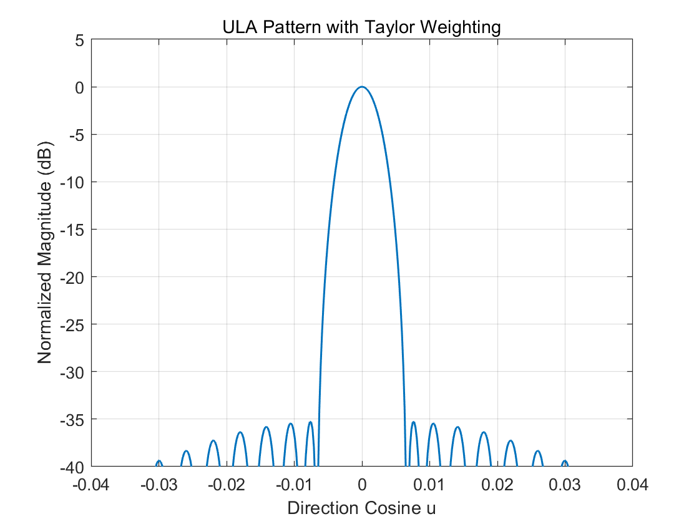
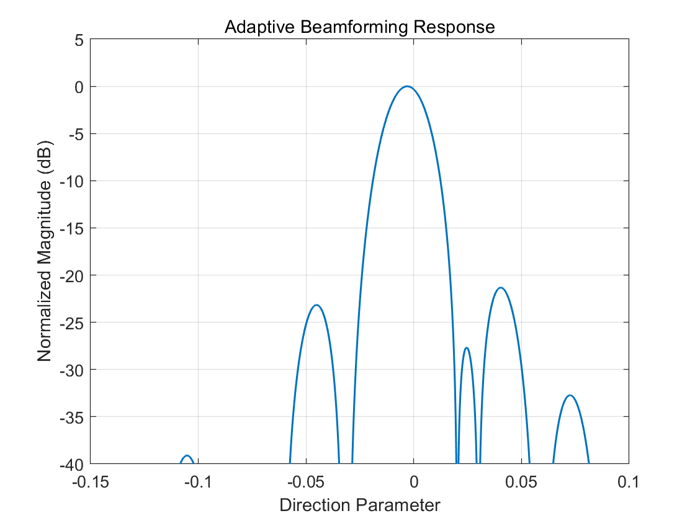
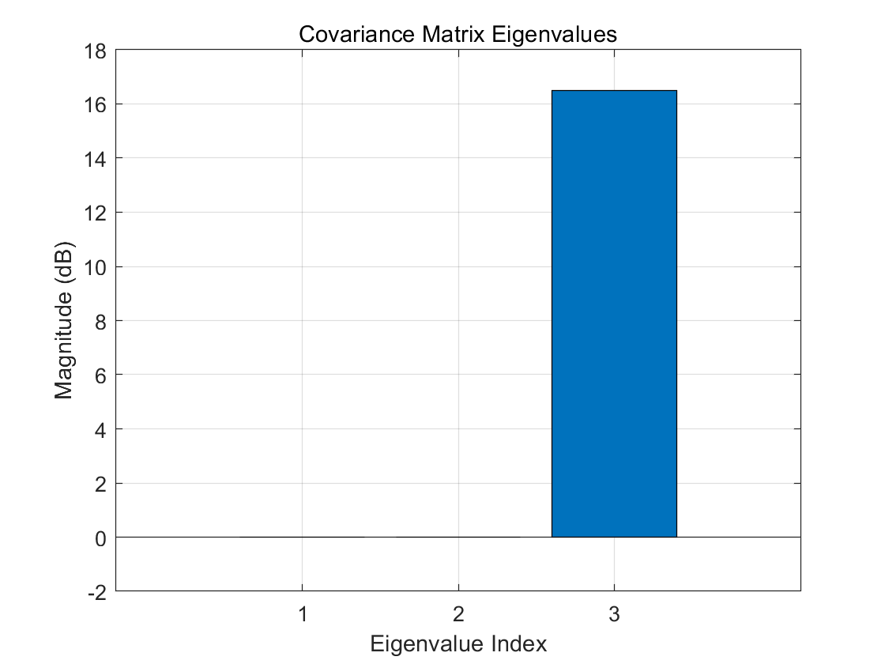

# Array Pattern Synthesis and Adaptive Beamforming in MATLAB

This project contains MATLAB implementations for phased-array radar concepts, including uniform linear array (ULA) pattern synthesis, Taylor-weighted beam pattern shaping, and covariance-based adaptive beamforming for interference suppression.

The implementations were created as personal radar signal processing practice projects based on concepts learned in academic coursework and independently reorganized into standalone demonstrations.

## Overview

The project focuses on basic phased-array radar processing and demonstrates how array weighting and adaptive processing influence beam patterns and interference suppression.

## Implemented Topics

- ULA beam pattern synthesis
- Taylor window weighting
- Steering vector modelling
- Covariance matrix-based adaptive processing
- Eigenvalue analysis for interference scenarios

## Example Results

  
  

  Left: ULA pattern with Taylor weighting. Right: adaptive beamforming response under jammer interference.

  

  Eigenvalue distribution of the covariance matrix.

## Files

- README.md
- ula_pattern_taylor_demo.m
- adaptive_beamforming_demo.m

## Requirements

- MATLAB
- Signal Processing Toolbox (recommended for `taylorwin`)

## How to Run

1. Open MATLAB.
2. Open the project folder.
3. Run `ula_pattern_taylor_demo` to generate the array pattern.
4. Run `adaptive_beamforming_demo` to simulate adaptive interference suppression.

## Notes

This repository is intended as a compact educational and portfolio-style implementation of phased-array and adaptive beamforming concepts.

Possible extensions:
- compare different array tapering windows
- investigate different jammer directions and power levels
- extend to larger arrays or multiple interferers
